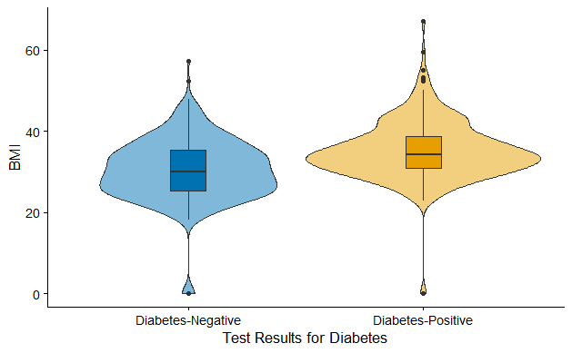
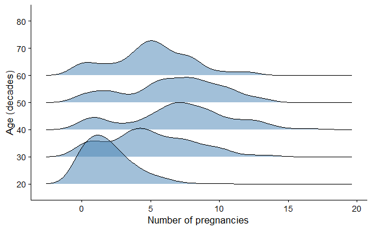
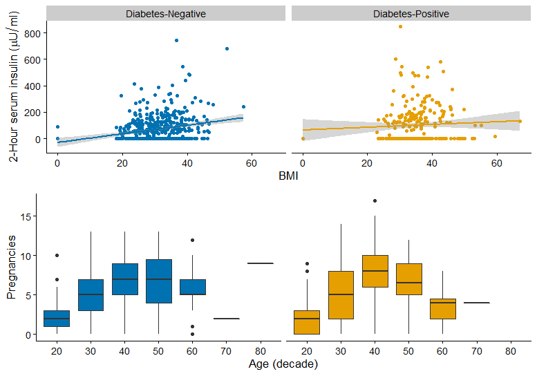
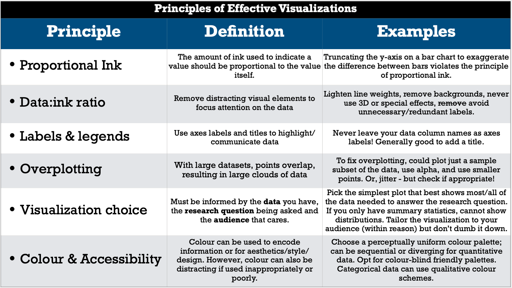
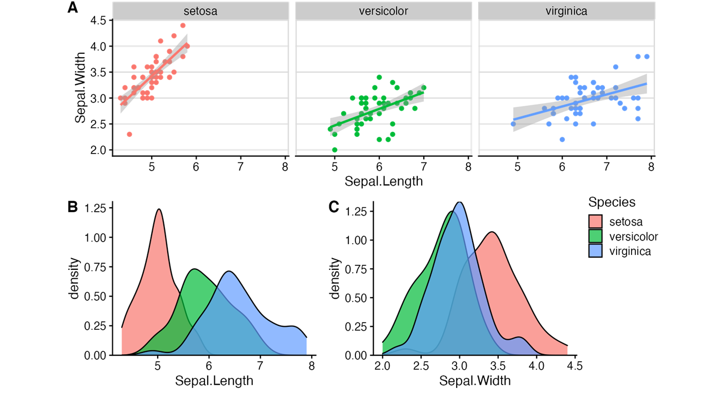

```{r include=FALSE}
knitr::opts_chunk$set(echo=TRUE)
```

```{r message=FALSE, warning=FALSE}
# loading required libraries
library(readr)
library(cowplot)
library(ggthemes)
library(tidyverse)
library(ggridges)
```

The biomedical data,  we are going to use is obtained from [Kaggle](https://www.kaggle.com/uciml/pima-indians-diabetes-database) website. You can find this dataset (`diabetes`) in a data folder. The dataset contains information about diabetes of cohort of sample subjects. This dataset arises from a research study of the National Institute of Diabetes and Digestive and Kidney Diseases (Smith et al. 1988). The purpose of the dataset is to predict whether or not a patient has diabetes. It is based on certain test measurements included in the dataset. Here, the patients are all females at least 21 years old of Pima Indian heritage.

The dataset consists of several medical predictors/features and one target/response variable named as Outcome: 

- `Pregnancies` - Number of times pregnant
- `Glucose` - Plasma glucose concentration a 2 hours in an oral glucose tolerance test
- `BloodPressure` - Diastolic blood pressure (mm Hg)
- `SkinThickness` - Triceps skin fold thickness (mm)
- `Insulin` - 2-Hour serum insulin (mu U/ml)
- `BMI` - Body mass index (weight in kg/(height in m)^2)
- `DiabetesPedigreeFunction` - Diabetes pedigree function
- `Age` - Age (years)
- `Outcome` - Diabetic outcome is given as binary, where “0” refers to norm.


# Task 1:

First import the dataset into the workspace:
```{r load-data}
# import the dataset into the workspace
diab<-read.csv("data/diabetes.csv") # It reads the CSV file and assigns to diab object
head(diab)
range(diab$Age)
```

Please use the code chunk below to perform any modifications to original dataset.
```{r}
diab1 <- diab %>% 
  #changing the Outcome variable to a factor (categorical)
  mutate(Outcome = factor(case_when(Outcome == 1 ~ "Diabetes-Positive",
                                    TRUE ~ "Diabetes-Negative"),
                                    levels = c('Diabetes-Negative', 'Diabetes-Positive'))) %>% 
  # creating a decade based age category variable, using case when to define the boundaries of the categories
  mutate(age_decade = factor(case_when(Age < 30 ~ "20",
                                   Age < 40 ~ "30",
                                   Age < 50 ~ "40",
                                   Age < 60 ~ "50",
                                   Age < 70 ~ "60",
                                   Age < 80 ~ "70",
                                   Age < 90 ~ "80",
                                   TRUE ~ "90+"))) 
  
```


Let's confirm the levels of the two new categorical variables... 

```{r}
levels(diab1$Outcome)
levels(diab1$age_decade)
```

A quick look at our new dataframe:

```{r}
head(diab1)
```

Great. It contains our new variable, age_decade, and re-named Outcome variable observations. 


Reproduce the following figures using the `diab` dataset:

## 1.1 Violin 



```{r answer1.1, fig.height=6, fig.width=10}
#Plot Recreation:
diab1 %>% 
  ggplot(aes(x = Outcome, y = BMI, fill = Outcome)) + #fill = Outcome fills each plot based on the outcome
  geom_violin(show.legend = FALSE, alpha = 0.5) + #show.legend=FALSE to remove legend that is generated by default
  geom_boxplot(width = 0.15, show.legend = FALSE, alpha = 0.8) + # using width modification to prevent boxplot from overwhelming the violin
  labs(x = "Test Results for Diabetes", y = "BMI") + 
  scale_fill_manual(values=c("#4287f5","#f2d563")) + #scale_fill_manual is used to manually set the colours, assigned in order to Outcomes
  theme_classic()
```

Looks good!


## 1.2 Ridge Plot



```{r answer1.2}
#Plot Recreation:
diab1 %>% 
  ggplot(aes(x = Pregnancies, y = age_decade)) + #calling appropriate variables
  geom_density_ridges2(fill = "#1a5eb8", alpha = 0.4) + #creating density plot, custom fill colour and alpha
  labs(y = "Age (decades)", x = "Number of pregnancies") + #custom axis labels 
  theme_classic() #matching theme
```

Looks good!


## 1.3 Composite Plot: scatter plot and baxplot plot 



```{r answer 1.3,  fig.height=7, fig.width=10}

# creating plots of serum insulin against BMI, facetted by diabetes outcome
p1_3_1 <- diab1 %>%  
  ggplot(aes(x = BMI, y = Insulin, color = Outcome)) + 
  geom_point(show.legend = FALSE) + 
  facet_wrap(. ~ Outcome) + # wrapping based on diabetes status
  geom_smooth(method = "lm", show.legend = FALSE) + #adding linear model visualization
  scale_color_manual(values = c("#4287f5","#f2d563")) + #manually assigning colours
  labs(x = "BMI", y = "2-Hour serum insulin (µU/mL)") + #custom axis labels
  theme_classic() + 
  theme(strip.background = element_rect(fill="grey", colour = NA), text = element_text(size = 20))  #customizing facet labels to match!

# creating plot of serum pregnancies against age, facetted by diabetes outcome
p1_3_2 <- diab1 %>% 
  ggplot(aes(x = age_decade, y = Pregnancies, fill = Outcome)) + 
  geom_boxplot(show.legend = FALSE) + #boxplot!
  facet_wrap(. ~ Outcome) +
  scale_fill_manual(values = c("#4287f5","#f2d563")) + #custom colours, matching above
  labs(x = "Age (decade)", y = "Pregnancies") + 
  theme_classic() +
  theme(strip.text = element_blank(), text = element_text(size = 20)) #removing facet label, as they will be portrayed when stacked by above^
  
# using plot_grid function to stack the above plots in one column
answer1.3 <- plot_grid(p1_3_1, p1_3_2, ncol = 1)

# printing recreated figure
answer1.3

```

Looks great!


# Task 2: Apply principles of effective visualizations

This exercise was adapted from emilyriederer [ugliest-ggplot-theme.R](https://gist.github.com/emilyriederer/2bf4f67d7e198f8359b61706c82e42ee) to to demonstrate the wide variety of `ggplot2 theme()` options.

Just as a reminder, refer to the principles of effective visualizations when completing this task.



Let's look at this plot:

```{r fig.height=6, fig.width=10}
# Plot
ggplot(diab1 %>%  filter(Age<50), 
       mapping = aes(x = BloodPressure, y = Pregnancies, col = age_decade)) + 
  geom_point(size = 5) + 
  facet_grid(Outcome ~ age_decade, switch = "y") +
  theme(
    plot.background = element_rect(fill = "lightyellow"),
    plot.title = element_text(size = 30, hjust = 0.25),
    plot.caption = element_text(size = 10, face = "italic", angle = 25),
    
    panel.background = element_rect(fill = 'lightblue', colour = 'darkred', size = 4),
    panel.border = element_rect(fill = NA, color = "green", size = 2),
    panel.grid.major.x = element_line(color = "purple", linetype = 2),
    panel.grid.minor.y = element_blank(),
    
    axis.title.x = element_text(face = "bold.italic", color = "blue"),
    axis.title.y = element_text(family = "mono", face = "bold", size = 20, hjust = 0.25),
    axis.text = element_text(face = "italic", size = 15),
    # note that axis.text options from above are inherited
    axis.text.x.bottom = element_text(angle = 180), 
    
    # generally will want to match w plot background
    legend.background = element_rect(fill = "orangered4"), 
    legend.key = element_rect(fill = "orange"),
    legend.direction = "horizontal",
    legend.position = "bottom") +
  
  labs(title = "Number of Times Pregnant vs Blood Pressure",
       subtitle = "this is not a nice plot",
       x = "Diastolic blood pressure (mm Hg)",
       y = "Number of times Pregnant",
       caption = "ages <50 are shown",
       col = "Renamed Legend") 
```


## 2.1 Summarize what is the role of arguments `plot.*`,`panel.*`,`axis.*`, and `legend.*`

`plot.*` arguments enable customization of the overall appearance of the plot, outside of the plotting surfaces (not including axis labels and titles). Examples of items that can be customized in this type of argument are the overall background, overall plot title, and plot captions, subtitles, margins and more. Customizations include colour, size, orientation, font style, and more. 
*plot.background* - customizes the background of the entire plot, not including the plotting surface panels
*plot.title* - allows customization of the overarching plot title (dimensions, location, etc.)
*plot.caption* - allows customization of plot caption (size, orientation, colour, etc.) 

`panel.*` arguments enable customization of the plotting surface panels. Examples of items that can be customized here include the background of the panel(s), the border around the panel(s), and the plotting panel grid lines, panel spacing, and more similar items. Customizations include colour, size/thickness, line types and more. 
*panel.background* - enables customization of the plotting surface panel background (above, colour was customized to blue)
*panel.border* - customization of the border around the plotting surface panels in the plot (above, border width and colour was customized)
*panel.grid.major.x* - customizing of the major x axis associated grid lines on the panel (above, colour and line type was customized). Note, minor grid line customization is also possible.
*panel.grid.minor.y* - enables customizing of the minor y axis associated grid lines on the panel (in the figure above, minor grid lines were removed). Note, major grid line customization of y axis associated lines is also possible, as above. 

`axis.*` arguments enable the customization of anything associated with the axes of the plot. This includes axis titles, text labels, ticks, lines and more by colour, spacing, size, orientation, and far more. 
*axis.title.x* - enables customization of the title for the x axis - specifically the font, size, colour, position, and more. 
*axis.title.y* - enables customization of the title for the y axis - specifically the font, size, colour, position, and more. 
*axis.text* - enables the customization of the text for both axis labels - specifically the font, font syle (face), size, colour, and more.  
*axis.text.x.bottom* - enables the customization of the text on the x axis labels only. Note, y axis specific cusomization is also available as `axis.text.y.*`.

`legend.*` arguments enable customization of plot legends. Examples of customizations include the legend background (colour, fill, etc.), key, position relative to overall plotting surface, orientation (horizontal/vertical), and more. 
*legend.background* - enables customization of the background of the legend (above, fill was customized to orangered4)
*legend.key* - enables customization of the background behind the legend key symbols (above, fill was customized to orange)
*legend.direction* - enables customization of the stacking of the legend key items (i.e. horizontally, vertically)
*legend.position* - enables customization of the location of the legend, either relative to the plotting surface, or custom using two position coordinates. 

**NOTE**: the ggplot webpage titled "Modify components of a theme" is an excellent resource for guidance on customizing themes, or understanding what a theme argument does. It can be found here: [Modify components of a theme](https://ggplot2.tidyverse.org/reference/theme.html). 


## 2.2 Based on your interpretation of this bad plot, what research question do you think the plot-creators are trying to answer with this plot?

**Research question I think they are trying to answer:** How do diabetes status and age influence the relationship between blood pressure and number of pregnancies in those under 50 years old?
**Reasoning:** The authours of this graph are clearly interested in showing the relationship between blood pressure and number of pregnancies, as that is the main focus of each plot in this figure. Additionally, they want to look at how both age and diabetes status may influence this relationship, hence their facetting based on both of these variables. 


## 2.3 Using the principles of effective visualization, correct the figure. Comment on the steps you took to improve the plot and explain your choice.

Below is a numbered list of the changes I made to the original plot to create the new and improved plot above. To make these changes, I worked through the code from top to bottom, reflected on what each argument does, and decided whether making a change to such argument would result in a more effective visualization. 

1. Reduce point size to reduce overlap (changed size from 5 to 3 in geom_point).
2. Add transparency to the points to highlight dense (overplotted) areas in the plot (added alpha = 0.6 in geom_point) 
3. Moved Outcome facet labels back to the default (right) side to prevent cluttering of the y-axis scale on the left size (removed switch = "y" from facet_grid)
4. Centered the main plot title and resized its text to make plot more visually appealing (changed the plot.title = element_text() arguments from size = 30 to 25 and hjust=0.25 to 0.5)
5. Centered the plot subtitle to match the main title (added plot.subtitle = element_text() hjust = 0.5)
6. Removed the awkward angle on the plot caption (removed angle argument from plot.caption = element_text())
7. Removed the blue background and replaced it with white to improve contrast between background and plotted points (changed panel.background = element_rect() fill to white)
8. Cleaned up the border around each panel to prevent distraction (first, I removed the argument panel.border to eliminate the distracting green border. Second, I recoloured and resized the panel background outline by editing the argument panel.background = element_rect() - changed the colour from maroon to black, and decreased the size from 4 to 2.)
9. Cleaned up the panel grid lines to support understanding of the graph, not distract the viewer (first, I removed the panel.grid.minor.y argument, as it wasn't actually contributing to the plot due to the element_blank (because no preset theme is used in this plot, we need to specify every part of the plot for it to exist!). I replaced this with a more appropriate panel.grid.major.y argument (as this argument will produce grid lines that line up with axis labels). I made both panel.grid.major arguments match for a clean looking plot - faint grid line types in grey colour (rather than the original and random purple). In my opinion, grid lines are very valuable to understanding relative measurements represented by points.
10. Fixed the axis title design by editing axis.title.* argument (specifically, I made the axis titles match in style and size, and used the default, professional looking font and black colour).
11. Re-formated the axis text (i.e. the numbers). Here, I decided that the italic font was unnecessary and distracting, and reverted back to normal face by removing the face argument within axis.text = element_text(). I also re-sized the axis text to size 12 within the same argument, as I felt size 14 was far too large. Finally, I removed the argument axis.text.x.bottom = element_text(angle = 180), because a flip in the x axis labels was unnecessary complexity and made the x axis text hard to read. 
12. Cleaned up the legend (first, I made the background of the legend match the background of the overall plot background to prevent excessive use of distracting colour (previously maroon coloured). I also decided that it would be beneficial to add a simple black border to the legend to make it appear as an organized and distinct component of the plot. Both of these changes were made in the legend.background = element_rect() argument. Second, I utilized the argument legend.key = element_rect() to match the legend key backgrounds to the plot background, to make the legend more simple and clear). 
13. I made changes in the labs() argument to better describe the plot and provide the relevant information to the viewer. Specifically, I rewrote the title to avoid using 'vs' (which I feel is informal), provided a detailed subtitle explaining the facetting that takes place in this plot, and renamed the legend more appropriately.
14. The caption was not contributing anything to the viewer's understanding of the plot at this point, so I decided to remove it from the plot entirely. This included removing 1) the plot.caption argument, and 2) the caption subargument within the labs argument. 


After making all of the above changes, I ended up with the following plot:

```{r exercise2.3,  fig.height=6, fig.width=10}
# Modified Plot 
ggplot(diab1 %>%  filter(Age<50), 
       mapping = aes(x = BloodPressure, y = Pregnancies, col = age_decade)) + 
  geom_point(size = 3, alpha = 0.6) + 
  facet_grid(Outcome ~ age_decade) +
  theme(
    plot.background = element_rect(fill = "lightyellow"),
    plot.title = element_text(size = 25, hjust = 0.5),
    plot.subtitle = element_text(hjust = 0.5),
    
    panel.background = element_rect(fill = 'white', colour = 'black', size = 2),
    panel.grid.major.x = element_line(color = "grey", linetype = 3),
    panel.grid.major.y = element_line(colour = "grey", linetype = 3),
    
    axis.title.x = element_text(size = 16, hjust = 0.5),
    axis.title.y = element_text(size = 16, hjust = 0.5),
    axis.text = element_text(size = 12),
    
    # generally will want to match w plot background
    legend.background = element_rect(fill = "lightyellow", colour = "black"), 
    legend.key = element_rect(fill = "lightyellow"),
    legend.direction = "horizontal",
    legend.position = "bottom") +
  
  labs(title = "Relationship Between Blood Pressure and the Number of Times Pregnant",
       subtitle = "In Women Under 50, separated by Diabetes Status and Decade of Age",
       x = "Diastolic Blood Pressure (mmHg)",
       y = "Number of Times Pregnant",
       col = "Age (by decade)") 
   
```

I still felt that this plot could be better. First, I thought that the yellow background was unnecessary, and so I removed it entirely (deleted plot.background = element_rect(fill = "lightyellow"), and edited the legend.background and legend.key arguments to match the white). Second, I thought that the coloured points (by age_decade) and top facet labels (20, 30, and 40) were relaying the same information (i.e. redundant), so I decided to remove the facet label titles and keep the legend and colour to provide the information on age in a single way. I also thought that the diabetes status facet labels were too small, so I increased their text size using strip.text.y = element_text(). Additionally, I wanted to make this plot more accessible, so I decided to use colour blind friendly colours (i.e. I added the arguement scale_colour_manual(values = c("#E69F00", "#009E73", "#56B4E9")). Finally, I thought that it made more sense to have number of times pregnant on the x axis, and blood pressure on the y axis, so I used coord_flip() to do this (note this was just personal preference). 

Here is the further improved plot: 

```{r exercise2.3,  fig.height=6, fig.width=10}
# FINAL Modified Plot 
ggplot(diab1 %>%  filter(Age<50), 
       mapping = aes(x = BloodPressure, y = Pregnancies, col = age_decade)) + 
  geom_point(size = 3, alpha = 0.6) + 
  facet_grid(Outcome ~ age_decade) +
  scale_colour_manual(values = c("#E69F00", "#009E73", "#56B4E9")) +
  theme(
    plot.title = element_text(size = 25, hjust = 0.5),
    plot.subtitle = element_text(hjust = 0.5),
    
    panel.background = element_rect(fill = 'white', colour = 'black', size = 2),
    panel.grid.major.x = element_line(color = "grey", linetype = 3),
    panel.grid.major.y = element_line(colour = "grey", linetype = 3),
    
    axis.title.x = element_text(size = 16, hjust = 0.5),
    axis.title.y = element_text(size = 16, hjust = 0.5),
    axis.text = element_text(size = 12),
    
    strip.text.x = element_blank(),
    strip.text.y = element_text(size = 12),
    
    # generally will want to match w plot background
    legend.background = element_rect(fill = "white", colour = "black"), 
    legend.key = element_rect(fill = "white"),
    legend.direction = "horizontal",
    legend.position = "bottom") +
  
  labs(title = "Relationship Between Blood Pressure and the Number of Times Pregnant",
       subtitle = "In Women Under 50, separated by Diabetes Status and Decade of Age",
       x = "Diastolic Blood Pressure (mmHg)",
       y = "Number of Times Pregnant",
       col = "Age (by decade)") +
  
  coord_flip()
```

This plot follows the principles for effective visualizations. It respects the principle of proportional ink, has a realistic data:ink ratio, has and informative and concise title, labels, and legend, handles overplotting well with point size and alpha transparency, uses an effective plot for conveying the intended information, and is accessible! Most important of all, it is conceptually uniform and visually pleasing. 

Based on this plot, it appears that there is little change in the relationship between blood pressure and the number of times pregnant, even when stratified by age (decades) and diabetes status. Some statistical tests would be helpful to confirm this.


# Task 3: Advanced Figure Design

Using `iris` dataset reproduce the following plot: 



First, a look at the iris data to familiarize myself with the variables:

```{r}
head(iris)
```

Let's recreate the plot!

```{r}

# creating plot A
plotA <- iris %>% 
  ggplot(aes(x = Sepal.Length, y = Sepal.Width, colour = Species)) + #colour set to species, default colour matches
  geom_point(show.legend = FALSE) + #remove legend with show.legend = FALSE
  geom_smooth(method = "lm", show.legend = FALSE) + #linear model visualization 
  facet_wrap(. ~ Species) + #facet wrapping on species to divide into 3 plots horizontally
  theme_cowplot() + #setting theme
  theme(panel.grid.major.y = element_line(colour = "gray"), #customizing background of plot to match
        panel.border = element_rect(colour = "gray"), 
        axis.title = element_text(size = 12)) #customizing axis label size

# creating plot B
plotB <- iris %>% 
    ggplot(aes(x = Sepal.Length, fill = Species)) + #filling based on species
    geom_density(alpha = 0.7, show.legend = FALSE) + #species fill inherited from above, default colours match example, custom transparency with alpha
    scale_y_continuous(breaks = seq(0, 1.25, by = 0.25), expand = c(0, 0), limits = c(0, 1.3)) + #customizing the y axis scale to match with more frequent breaks than default
    theme_cowplot() +
    theme(axis.title = element_text(size = 12))

# creating plot C
plotC <- iris %>% 
    ggplot(aes(x=Sepal.Width, fill = Species)) + 
    geom_density(alpha = 0.7) +
    scale_y_continuous(breaks = seq(0, 1.25, by = 0.25), expand = c(0, 0), limits = c(0, 1.35)) +
    theme_cowplot() +
    theme(legend.justification = c("right", "top"), #legend stays in this one, with position customization to top right
          legend.title = element_text(size = 12), #custom legend title size
          legend.text = element_text(size = 10), #custom legend text size
          axis.title = element_text(size = 12))


### Now, combining the 3 plots using cowplot... this will need to be nested because of the different size plots on each row...

#creating the bottom part of the plot by combining plotB and plotC with plot_grid
bottom <- plot_grid(plotB, plotC, labels = c('B', 'C'), nrow = 1, rel_widths = c(1.5,2)) #rel.width customization to accommodate legend on plotC

#creating final plot with plot_grid using plotA as top and plot named 'bottom' (directly above) as bottom in 1 column. 
answer3 <- plot_grid(plotA, bottom, labels = c('A', ''), ncol = 1) 

answer3

```

Looks good!


# Task 4 (OPTIONAL): Making Ethical Data Decisions 

Note: this exercise is not required, but you can only get up to 95% completing exercises 1-3.

Imagine that during a survey, the patients were asked to answer the question of their ethnicity:

The Canadian Census identifies the following categories in its Census of the Population (see options below). Please indicate how you self-identify (you can select more than one category). This self-identification is not intended as an indication of one’s place of origin, citizenship, language or culture and recognizes that there are differences both between and among subgroups of persons of colour. If you are of mixed-descent, please indicate this by selecting all that apply, rather than using the “other” line unless parts of your self-identification do not appear in this list.

- Indigenous person of Canada (First Nations, Inuit, Métis) 
- Indigenous (outside of Canada) 
- Arab 
- Black 
- Chinese (including Hong Kong and Macau) 
- Filipino 
- Japanese 
- Korean 
- Latin, Central, or South American (e.g. Brazilian, Chilean, Colombian, Mexican) 
- South Asian (e.g. Indian, Pakistani, Sri Lankan, etc.) 
- Southeast Asian (e.g. Cambodian, Indonesian, Laotian Vietnamese, etc) 
- West Asian (e.g. Afghan, Iranian, Syrian, etc) 
- White 
- None of the above 
- Prefer not to answer 


Import the dataset `ethnicity_data.csv` and examine how "messy" the data input format. 

```{r}
ethnicity <- read.csv("data/ethnicity_data.csv")

ethnicity
```

Imagine you were tasked to present the data for the conference/board meeting to show the ethnic diversity of your patients.


## 4.1 Wrangling practice

First, try to convert the dataset in a more tidy form (For instance, making ethnicity labels shorter: `Chinese (including Hong Kong and Macau)` transformed to `Chinese`). Hint: you can create a new column for each ethnicity, and add value 1 if the person selected that category , and 0 if it was not selected. 

Here are the 15 different ethnicity categories, unique string identifiers for cleaning the data, and a shorter variable name. 
- Indigenous person of Canada (First Nations, Inuit, Métis) -- *#unique identifier = Inuit*, name = Indigenous (in Canada)
- Indigenous (outside of Canada) -- *#unique = outside*, name = Indigenous (outside Canada)
- Arab -- *#unique = Arab*, name = Arab
- Black -- *#unique = Black*, name = Black
- Chinese (including Hong Kong and Macau) -- *#unique = Chinese*, name = Chinese
- Filipino -- *#unique = Filipino*, name = Filipino
- Japanese -- *#unique = Japanese*, name = Japanese
- Korean -- *#unique = Korean*, name = Korean
- Latin, Central, or South American (e.g. Brazilian, Chilean, Colombian, Mexican) -- *#unique = Latin*, name = Latin, Central or South American
- South Asian (e.g. Indian, Pakistani, Sri Lankan, etc.) -- *#unique = Indian*, name = South Asian
- Southeast Asian (e.g. Cambodian, Indonesian, Laotian Vietnamese, etc) -- *#unique = Cambodian*, name = Southeast Asian
- West Asian (e.g. Afghan, Iranian, Syrian, etc) -- *#unique = West*, name = West Asian
- White -- *#unique = White*, name = White
- None of the above -- *#unique = None*, name = None of the above
- Prefer not to answer -- *#unique = Prefer*, name = Prefer not to answer

Lets clean up the data and assign it to a new variable, ethnicityclean...

```{r exercise4.1}

ethnicityclean <- ethnicity %>% 
   mutate('Indigenous (in Canada)' = factor(case_when(str_detect(Ethnicity, "Inuit") ~ "1", 
                                                           TRUE ~ "0"))) %>% 
   mutate('Indigenous (outside Canada)' = factor(case_when(str_detect(Ethnicity, "outside") ~ "1", 
                                                           TRUE ~ "0"))) %>% 
   mutate(Arab = factor(case_when(str_detect(Ethnicity, "Arab") ~ "1", 
                                                           TRUE ~ "0"))) %>% 
   mutate(Black = factor(case_when(str_detect(Ethnicity, "Black") ~ "1", 
                                                           TRUE ~ "0"))) %>% 
   mutate(Chinese = factor(case_when(str_detect(Ethnicity, "Chinese") ~ "1", 
                                                           TRUE ~ "0"))) %>% 
   mutate(Filipino = factor(case_when(str_detect(Ethnicity, "Filipino") ~ "1", 
                                                           TRUE ~ "0"))) %>% 
   mutate(Japanese = factor(case_when(str_detect(Ethnicity, "Japanese") ~ "1", 
                                                           TRUE ~ "0"))) %>% 
   mutate(Korean = factor(case_when(str_detect(Ethnicity, "Korean") ~ "1", 
                                                           TRUE ~ "0"))) %>% 
   mutate('Latin, Central, or South American' = factor(case_when(str_detect(Ethnicity, "Latin") ~ "1", 
                                                           TRUE ~ "0"))) %>% 
   mutate('South Asian' = factor(case_when(str_detect(Ethnicity, "Indian") ~ "1", 
                                                           TRUE ~ "0"))) %>% 
   mutate('Southeast Asian' = factor(case_when(str_detect(Ethnicity, "Cambodian") ~ "1", 
                                                           TRUE ~ "0"))) %>% 
   mutate('West Asian' = factor(case_when(str_detect(Ethnicity, "West") ~ "1", 
                                                           TRUE ~ "0"))) %>% 
   mutate(White = factor(case_when(str_detect(Ethnicity, "White") ~ "1", 
                                                           TRUE ~ "0"))) %>% 
   mutate('None of the above' = factor(case_when(str_detect(Ethnicity, "None") ~ "1", 
                                                           TRUE ~ "0"))) %>% 
   mutate('Prefer not to answer' = factor(case_when(str_detect(Ethnicity, "Prefer") ~ "1", 
                                                           TRUE ~ "0")))

ethnicityclean
```


Did not have time to finish below...

## 4.2 Visualization Practice

Second, Try to create a visual to effectively show the diversity of patients' ethnicity. It can be either table or a figure. This task is not easy, so it is okey that your visual wont be perfect. Please discuss what aspects of your figure still needs improvement and describe or describe how you see the ideal images in this case.

```{r fig.height=10, fig.width=10}
# loaded extra libraries

```


# Submit Document

- knit the document to pdf file.you need to have a TinyTeX  to be able to knit the document:

```
install.packages('tinytex')
tinytex::install_tinytex()
```
- make sure the document is tidy, code chunks has sufficient comments, your writing is clear and has no typos.


# References

Smith, J.W., Everhart, J.E., Dickson, W.C., Knowler, W.C., & Johannes, R.S. (1988). Using the ADAP learning algorithm to forecast the onset of diabetes mellitus. In Proceedings of the Symposium on Computer Applications and Medical Care (pp. 261--265). IEEE Computer Society Press.